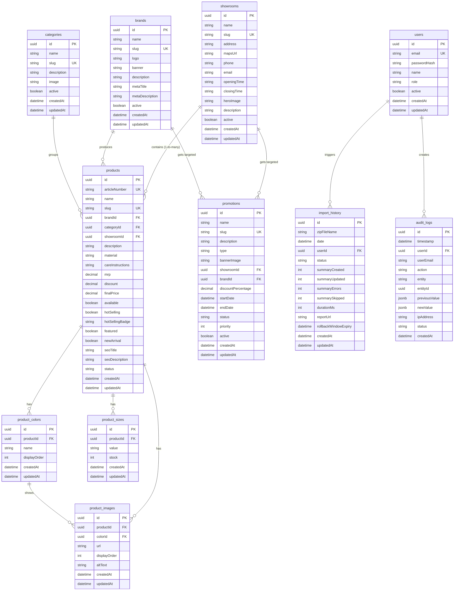

# DATABASE.md
# Database Schema & Enterprise Scaling Blueprint

This document details the database layout, relationships, performance indexing strategies, and future expansion paths.

---

## 1. Relational Entity Relationship (ER) Summary

The FootCare catalogue is modeled inside PostgreSQL. One product is located in exactly one showroom, while maintaining relations to brands and categories.

---

## 2. Performance Indexing Strategies

To ensure sub-second search speeds across large collections, we configure the following database indexes:
* **Unique Slugs:** Unique indexes on `slug` columns in `products`, `brands`, `showrooms`, `categories`, and `promotions` for quick key-based page rendering.
* **Foreign Key References:** B-Tree indexes on `products(brandId)`, `products(categoryId)`, and `products(showroomId)` to optimize related product lookups.
* **Search & Filters:**
  * B-Tree index on `products(finalPrice)` for sorting by price.
  * Multi-column index on `products(available, status, newArrival)` for catalog category filtering.
  * GIN (Generalized Inverted Index) on `products(name, articleNumber)` for fuzzy search optimization.

---

## 3. Migration Path to E-Commerce (Future Expansion)

Transitioning to transactional e-commerce will not require redesigning the existing tables. We will expand the schema by adding the following independent tables:
* **`customers`:** Manages registered shoppers, emails, credentials, and default shipping addresses.
* **`baskets` & `basket_items`:** Store client checkout baskets in database state.
* **`orders` & `order_lines`:** Maps an finalized order to products, capturing the actual purchased prices, sizes, and colors at checkout time.
* **`transactions`:** Tracks payment gateway statuses, transaction IDs (Stripe, Razorpay, etc.), and checkout logs.
